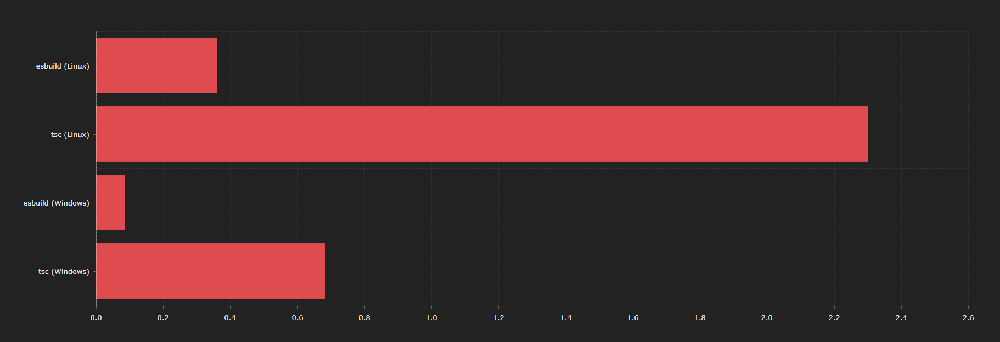
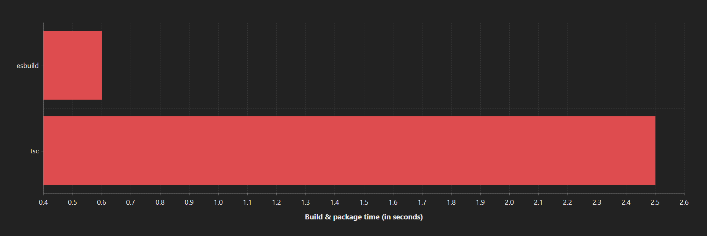

# esbuild-azure-functions <!-- omit in toc -->

> A builder for Azure Function powered by esbuild.

[](https://github.com/beyerleinf/esbuild-azure-functions/actions/workflows/ci.yml) [](https://app.codecov.io/gh/beyerleinf/esbuild-azure-functions) [](https://www.npmjs.com/package/esbuild-azure-functions) [](https://www.npmjs.com/package/esbuild-azure-functions) [](https://github.com/beyerleinf/esbuild-azure-functions/blob/main/LICENSE)

This tool is designed to work with Azure Functions written in TypeScript. It uses [esbuild](https://esbuild.github.io/) to create crazy small bundles. This is especially helpful with cold starts and deployment duration.

***Please read this readme to get started. It contains important information.***

# Table of Contents <!-- omit in toc -->
- [Build](#build)
  - [From the CLI](#from-the-cli)
  - [Programmatically](#programmatically)
- [Watch mode](#watch-mode)
  - [From the CLI](#from-the-cli-1)
  - [Programmatically](#programmatically-1)
- [Config](#config)
  - [`project`](#project)
  - [`entryPoints`](#entrypoints)
  - [`exclude`](#exclude)
  - [`clean`](#clean)
  - [`logLevel`](#loglevel)
  - [`esbuildOptions`](#esbuildoptions)
  - [`advancedOptions`](#advancedoptions)
    - [`enableDirnameShim`](#enabledirnameshim)
- [Common errors](#common-errors)
  - [`ReferenceError: [__dirname|__filename] is not defined in ES module scope`](#referenceerror-__dirname__filename-is-not-defined-in-es-module-scope)
  - [`Error: Dynamic require of "xyz" is not supported`](#error-dynamic-require-of-xyz-is-not-supported)
- [Benchmark](#benchmark)
  - [Package size](#package-size)
  - [Build time](#build-time)

## Build

### From the CLI

By default, *esbuild-azure-functions* expects a config file called `esbuild-azure-functions.config.json` in the directory you are running it from. You can specify a different config location with the `-c | --config` flag. Refer to the [Config section](#config) for config options.

```
npx esbuild-azure-functions [-c <config location>]
```

### Programmatically

Install *esbuild-azure-functions* into your project

```
npm i --save-dev esbuild-azure-functions
```

```ts
import { build, BuilderConfigType } from 'esbuild-azure-functions';

const config: BuilderConfigType = {
  project: process.cwd(),
  esbuildOptions: {
    outdir: 'MyCustomOutDir'
  }
};

const main = async () => {
  await build(config);
}

main();

```

## Watch mode

### From the CLI

By default, *esbuild-azure-functions* expects a config file called `esbuild-azure-functions.config.json` in the directory you are running it from. You can specify a different config location with the `-c | --config` flag. Refer to the [Config section](#config) for config options.

```
npx esbuild-azure-functions --watch [-c <config location>]
```

### Programmatically

Install *esbuild-azure-functions* into your project

```
npm i --save-dev esbuild-azure-functions
```

```ts
import { watch, BuilderConfigType } from 'esbuild-azure-functions';

const config: BuilderConfigType = {
  project: process.cwd(),
  esbuildOptions: {
    outdir: 'MyCustomOutDir'
  }
};

const main = async () => {
  await watch(config);
}

main();

```

## Config

**Important: By default, the file extension of output files is set to `.mjs`. This is because the Azure Functions runtime requires this [see Microsoft Docs](https://docs.microsoft.com/en-us/azure/azure-functions/functions-reference-node?tabs=v2-v3-v4-export%2Cv2-v3-v4-done%2Cv2%2Cv2-log-custom-telemetry%2Cv2-accessing-request-and-response%2Cwindows-setting-the-node-version#ecmascript-modules). You need to change the `scriptFile` property of your *function.json* files accordingly.**

A simple starting config could look like this
```json
{
  "project": ".",
  "esbuildOptions": {
    "outdir": "MyCustomOutDir"
  }
}
```

### `project`

**Required:** yes  
**Type:** `string`  
**Description:** The root folder of the Azure Functions project you want to build.  
**Example:** `.`  
**Default:** `undefined`

### `entryPoints`

**Required:** no  
**Type:** `string[]`  
**Description:** Specify custom entry points if you don't want *esbuild-azure-functions* to search for **index.ts** files in the `project` folder.  
**Example:** `[ "my-functions/entry.ts" ]`  
**Default:** `undefined`

### `exclude`

**Required:** no  
**Type:** `string[]`  
**Description:** Specify directories as glob patterns to exclude when searching for **index.ts** files.  
**Example:** `[ "**/utils/**" ]`  
**Default:** `undefined`

### `clean`

**Required:** no  
**Type:** `boolean`  
**Description:** Specify whether *esbuild-azure-functions* should the delete the output directory before building.  
**Default:** `false`

### `logLevel`
**Required:** no  
**Type:** `"off" | "error" | "warn" | "info" | "verbose"`  
**Description:** Specify the verbosity of log messages.  
**Default:** `"error"`

### `esbuildOptions`

**Required:** no  
**Type:** [Refer to the official docs](https://esbuild.github.io/api/#build-api)  
**Description:** Customize the default esbuild config used.  
**Default:**
```ts
{
  minify: true,
  bundle: true,
  sourcemap: false,
  watch: false,
  platform: 'node',
  splitting: true,
  format: 'esm',
  outdir: 'dist',
  outExtension: { '.js': '.mjs' },
}
```

### `advancedOptions`
**Required:** no  
**Type:** `object`  
**Description:** Enable some advanced options depending on your environment

#### `enableDirnameShim`
**Required:** no  
**Type:** `boolean`  
**Description:** Enables a plugin that patches `__dirname` and `__filename` using `import.meta.url` ([see official Node.js docs](https://nodejs.org/docs/latest/api/esm.html#no-__filename-or-__dirname)) at the top of every output file because they are not available in ESM and esbuild doesn't shim them itself.

## Common errors

### `ReferenceError: [__dirname|__filename] is not defined in ES module scope`

This error stems from the fact that `__dirname` and `__filename` are not present in an ESM environment. To fix this, simply set `advancedOptions.enableDirnameShim` to `true` [see config](#enabledirnameshim)

### `Error: Dynamic require of "xyz" is not supported`

This error stems from esbuild not being able to convert CJS requires to ESM imports. This happens mostly (from what I've seen) with Node.js internals (like http, crypto and so on). To fix this issue you have two options:
1. Turn code splitting of and change the format to `cjs` **(not recommended because it increases the bundle size exponentially)** 

```js
// build.mjs

await build({
  project: '.',
  clean: true,
  esbuildOptions: {
    splitting: false,
    format: 'cjs',
    outExtension: {}
  },
});
```

2. Use `@esbuild-plugins/esm-externals` with the following setup:

```js
// build.mjs

import { EsmExternalsPlugin } from '@esbuild-plugins/esm-externals';
import { build } from 'esbuild-azure-functions';
import repl from 'repl';

await build({
  project: '.',
  exclude: ['**/utils/**'],
  clean: true,
  logLevel: 'verbose',
  esbuildOptions: {
    target: 'node12',
    plugins: [
      EsmExternalsPlugin({ externals: [...repl._builtinLibs] })
    ],
  },
});
```

If there are other modules causing issues for you, just add them to the `externals` options of `EsmExternalsPlugin`.

## Benchmark

### Package size



### Build time

