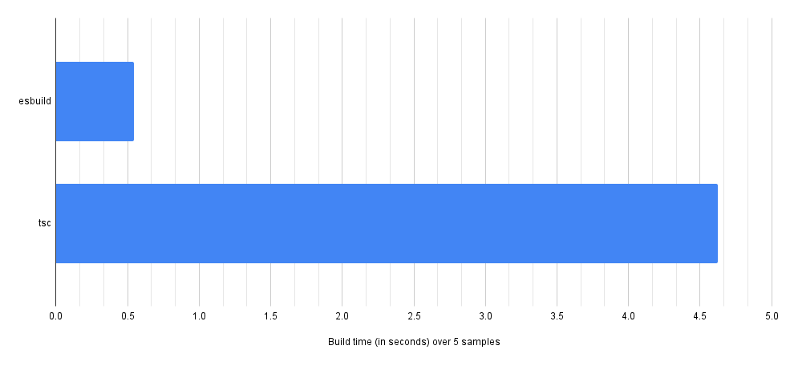

# esbuild-azure-functions <!-- omit in toc -->

> A ✨blazingly fast✨ builder for Azure Function powered by esbuild.

       

This tool is designed to work with Azure Functions written in TypeScript. It uses [esbuild](https://esbuild.github.io/) to create crazy small bundles. This is especially helpful with cold starts and deployment duration.

# Table of Contents <!-- omit in toc -->

- [Documentation](#documentation)
- [Benchmark](#benchmark)
  - [Package size](#package-size)
  - [Build time](#build-time)
- [Contributing](#contributing)

## Documentation

You find the the complete documentation at [https://beyerleinf.gitbook.io/esbuild-azure-functions/](https://beyerleinf.gitbook.io/esbuild-azure-functions/).

## Benchmark

### Package size

### Build time

## Contributing

You want to contribute? Nice! Be sure to check out [CONTRIBUTNG.md](CONTRIBUTING.md) on how to get started.
